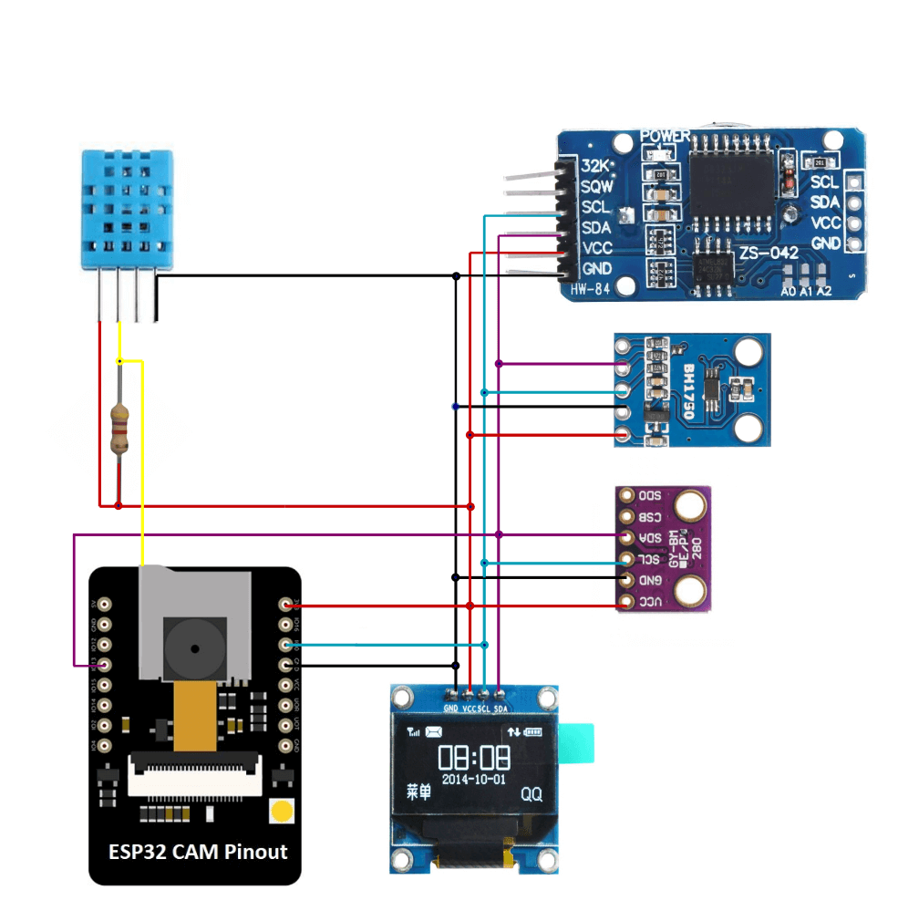
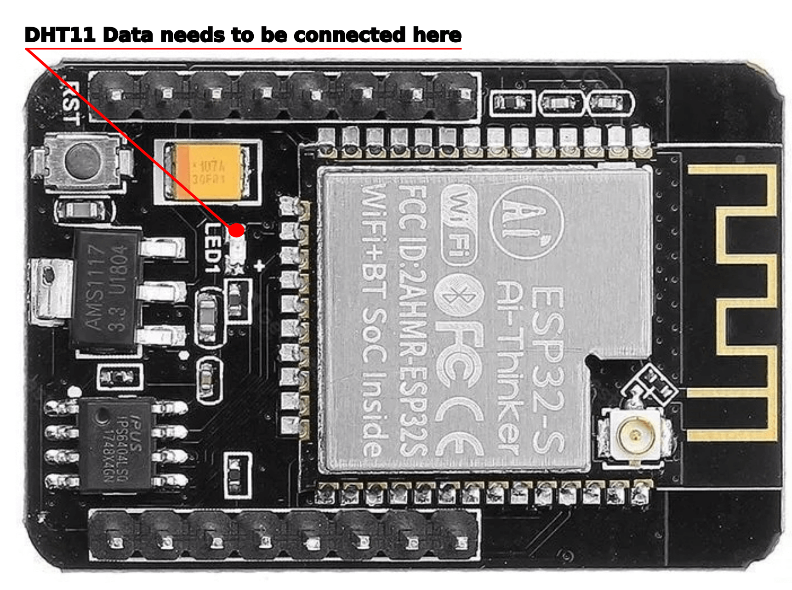

# Weather Station and logger based on ESP32

The Weather Station measures: Temperature, Humidity, Atm Pressure and Solar exposure. It also keeps track of current date and time and take pictures. All of this data is logged on local storage (i.e. SD card). Main measurements are displayed in real time on the device OLED screen. All current and historical data can also be viewed by the web intreface as well as fetched by API.
All user interactions are made by web interface. Besides display and on/off switch, the device has no other way to communicate with user.
The purpose of the device is to deliver historical weather informations along with pictures of those conditions, for further analysis.
Device can be used as weather conditions logger, time-lapse camera or just home weather station.

## Hardware

|  Type | Name/Info  | Libs  |
| ------------ | ------------ | ------------ |
| MCU  | [ESP32-CAM](https://docs.platformio.org/en/latest/boards/espressif32/esp32cam.html)  | [ESP-IDF](https://github.com/espressif/esp-idf)  |
| Humidity/Temperature  | [DHT11](http://gotronik.pl/img/dht11.pdf) | [Anacron-mb/esp32-DHT11](https://github.com/Anacron-mb/esp32-DHT11)  |
| Pressure/Temperature  |[BMP280](https://www.bosch-sensortec.com/products/environmental-sensors/pressure-sensors/bmp280/)| [Adafruit_BMP280_Library](https://github.com/adafruit/Adafruit_BMP280_Library); [Adafruit_Sensor](https://github.com/adafruit/Adafruit_Sensor); [Adafruit_BusIO](https://github.com/adafruit/Adafruit_BusIO); [arduino-esp32](https://github.com/espressif/arduino-esp32) |
|Light   |[BH1750](https://www.handsontec.com/dataspecs/sensor/BH1750%20Light%20Sensor.pdf)   |  [claws/BH1750](https://github.com/claws/BH1750); [arduino-esp32](https://github.com/espressif/arduino-esp32)  |
|OLED |[GME12864-41/ SSD1306](https://nettigo.pl/products/wyswietlacz-oled-0-96-i2c-128x64-ssd1306-bialy) \| [Reserve info](https://datasheethub.com/ssd1306-128x64-mono-0-96-inch-i2c-oled-display/) |[Adafruit_SSD1306](https://github.com/adafruit/Adafruit_SSD1306); [Adafruit-GFX-Library](https://github.com/adafruit/Adafruit-GFX-Library); [arduino-esp32](https://github.com/espressif/arduino-esp32) |
RTC | [HW084 / DS3231](http://www.szhwmake.com/prod_view.aspx?TypeId=83&Id=350&FId=t3:83:3) \| [Reserve info](https://lastminuteengineers.com/ds3231-rtc-arduino-tutorial/) |[ErriezDS3231 (modified)](https://github.com/k-nowicki/ErriezDS3231) |

## Connections

DHT11 sensor needs to be soldered to GPIO33 which is hardwired to onboard LED (*)

## Environment requirements
Warning: This is not an arduino project! It needs ESP-IDF environment installed on development machine (developed on ESP-IDF v4.4.3).
[Follow the instructions](https://docs.espressif.com/projects/esp-idf/en/v4.4.3/esp32/get-started/index.html "ESP-IDF Framework") to install all necessary software. After installing check your setup first with one of the ESP-IDF examples.

## How to flash your ESP32
Instructions on how to connect and flash esp32 can be found also on [espressiff docs](https://docs.espressif.com/projects/esp-idf/en/v3.3.5/get-started-cmake/index.html#step-9-flash-to-a-device "espressiff docs").

## Project status: under development
 This project is still under development. Majority of features mentioned above are not implemented yet.
 What is implemented:
  - OLED Display displays current measurements, date and time
  - Sensors: pressure, temperature from two sensors, humidity and light are implemented and measured
  - External and internal RTCs with periodic NTP time sync
  - WiFi connectivity (with credentials configured by menuconfig for now)
  - SD card with file system (sadly requires physical hacking of the esp32-cam board *)
  - Logging of measurements in json formatted logs 
  - Logging of measurements in CSV formatted logs (about 2.5 times denser than json)
  - HTTP(S) server (serve files from SD and respond to API calls)
  - Web application files added (put the /www directory in root dir of SD card)
  
  
  *) DHT11 sensor needs to be connected to GPIO33 which on the board is not connected to any pin. Instead Adafruit designed the board so that the GPIO33 (which unlike any other available pin has no second function) is connected exclusively to onboard LED. 
It may be that connections can be rearanged in the way that everyfing fits nicely, but this needs more research...