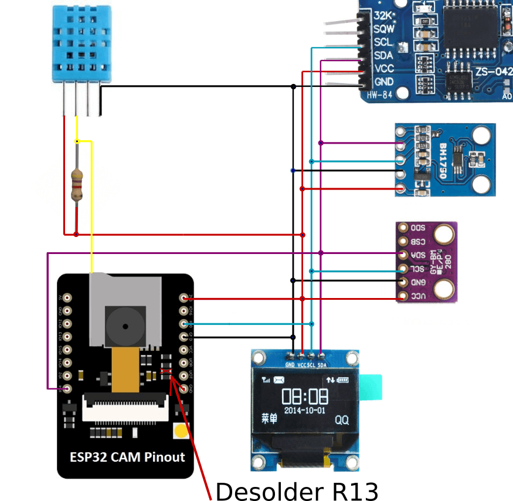

# Weather Station and logger based on ESP32

The Weather Station measures: Temperature, Humidity, Atm. Pressure and Solar exposure. It also keeps track of current date and time and take pictures. All of this data is logged on local storage (i.e. SD card). Main measurements are displayed in real time on the device OLED screen. All current and historical data can also be viewed by the web interface as well as fetched by API.
All user interactions are made by web interface. Besides display and on/off switch, the device has no other way to communicate with user.
The purpose of the device is to deliver historical weather informations along with pictures of those conditions, for further analysis.
Device can be used as weather conditions logger, time-lapse camera or just home weather station.

## Hardware

|  Type | Name/Info  | Libs  |
| ------------ | ------------ | ------------ |
| MCU  | [ESP32-CAM](https://docs.platformio.org/en/latest/boards/espressif32/esp32cam.html)  | [ESP-IDF](https://github.com/espressif/esp-idf)  |
| Humidity/Temperature (VAR 1) | [DHT11](http://gotronik.pl/img/dht11.pdf) | [Anacron-mb/esp32-DHT11](https://github.com/Anacron-mb/esp32-DHT11)  |
| Humidity/Temperature (VAR 2) | [HTU21](https://cdn-shop.adafruit.com/datasheets/1899_HTU21D.pdf) | [Adafruit_HTU21DF](https://github.com/adafruit/Adafruit_HTU21DF_Library)  |
| Pressure/Temperature  |[BMP280](https://www.bosch-sensortec.com/products/environmental-sensors/pressure-sensors/bmp280/)| [Adafruit_BMP280_Library](https://github.com/adafruit/Adafruit_BMP280_Library); [Adafruit_Sensor](https://github.com/adafruit/Adafruit_Sensor); [Adafruit_BusIO](https://github.com/adafruit/Adafruit_BusIO); [arduino-esp32](https://github.com/espressif/arduino-esp32) |
|Light   |[BH1750](https://www.handsontec.com/dataspecs/sensor/BH1750%20Light%20Sensor.pdf)   |  [claws/BH1750](https://github.com/claws/BH1750); [arduino-esp32](https://github.com/espressif/arduino-esp32)  |
|Wind   |[KK-ANEMO]()   |  [KK-ANEMO]()|
|OLED |[GME12864-41/ SSD1306](https://nettigo.pl/products/wyswietlacz-oled-0-96-i2c-128x64-ssd1306-bialy) \| [Reserve info](https://datasheethub.com/ssd1306-128x64-mono-0-96-inch-i2c-oled-display/) |[Adafruit_SSD1306](https://github.com/adafruit/Adafruit_SSD1306); [Adafruit-GFX-Library](https://github.com/adafruit/Adafruit-GFX-Library); [arduino-esp32](https://github.com/espressif/arduino-esp32) |
RTC (Var 1)| [HW084 / DS3231](http://www.szhwmake.com/prod_view.aspx?TypeId=83&Id=350&FId=t3:83:3) \| [Reserve info](https://lastminuteengineers.com/ds3231-rtc-arduino-tutorial/) |[ErriezDS3231 (modified)](https://github.com/k-nowicki/ErriezDS3231)|
RTC (Var 2)| [TinyRTC / DS1307](https://www.analog.com/media/en/technical-documentation/data-sheets/DS1307.pdf) \| [Reserve info](https://lastminuteengineers.com/ds1307-rtc-arduino-tutorial/) | [ErriezDS1307 (modified)](https://github.com/Erriez/ErriezDS1307)|
| SD Card  | Any standard SDSC/SDHC/SDXC Card (preffered at least 8GB for picture storage)  | [ESP-IDF](https://github.com/espressif/esp-idf)  |

## Connections

R13 resistor needs to be desoldered (**)

DHT11 sensor needs to be soldered to GPIO33 which is hardwired to onboard LED (*)

Warning! On the schematic above SCL and SDA are swapped, you need to change definitions in setup.h or connect them the other way round.

## Environment requirements
This project needs ESP-IDF environment installed on development machine (developed on ESP-IDF v4.4.3).
[Follow the instructions](https://docs.espressif.com/projects/esp-idf/en/v4.4.3/esp32/get-started/index.html "ESP-IDF Framework") to install all necessary software. After installing check your setup first with one of the ESP-IDF examples.

## How to flash your ESP32
Instructions on how to connect and flash esp32 can be found also on [espressif docs](https://docs.espressif.com/projects/esp-idf/en/v3.3.5/get-started-cmake/index.html#step-9-flash-to-a-device "espressiff docs").

## Project status: under development
 This project is still under development. Not all features mentioned above are implemented yet.
 
 What is implemented:
  - OLED Display displays current measurements, date, time and IP address
  - Sensors: pressure, temperature from two sensors, humidity, light and wind***
  - External and internal RTCs with periodic NTP time sync
  - WiFi connectivity (with credentials configured by menuconfig)
  - SD card with file system
  - Logging of measurements in json and CSV formatted logs in two densities (1/min -averaged and 1/sec)
  - HTTPS server (serves files from SD and responds to API calls)
  - Camera takes pictures every 5sec. Current picture is displayed on index web page below measurements.
  - Every 5 minutes new picture is saved to SD card
  - Web application for displaying measurements, pictures and logs (with https)
  
  *) DHT11 sensor if used, needs to be connected to GPIO33 which on the board is not connected to any external I/O pin. Instead Adafruit designed the board so that the GPIO33 (which unlike any other available pin has no second function) is connected exclusively to on board LED.

**) I2C_SCL needs to be defined as GPIO4 (There is no other free IO that can be used as I2C signal). But for it to work there is another small hack needed. R13 resistor needs to be desoldered from esp32-cam board. If R13 is not removed, the FLASH_LED driver forces GPIO4 to be max 0.7V and I2C bus will not work.

***) Wind anemometer (KK-ANEMO) connected to I2C bus is also under development. Project will be published soon as open source.

## Assembly and getting ready
Once you have all modules and parts needed as well as software installed:
 - prepare the esp32 board and connect all as shown on the schematic above
 - copy *www* directory with its content to root dir of SD card
 - use menuconfig ( <code>idf.py menuconfig</code> from project root dir) to set:
  - WiFi credentials [KK_Connection_Configuration]
  - RTC type [KK_RTC_Configuration]
 - use setup.h to verify/set:
  - I2C_SDA and I2C_SCL to be consistent with actual connections
  - uncomment definition of used external sensor: <code>EXTERNAL_SENSOR_DHT11</code> or <code>EXTERNAL_SENSOR_HTU21</code>
 - compile the code <code>idf.py build</code>
 - connect the esp32 board to USB and enter flash mode (pull-down GPIO0 and press RESET button)
 - upload flash content and run serial monitor <code>idf.py -p \<COM_PORT> flash monitor</code>  
Replace <code>\<COM_PORT></code> with that in your setup, for example COM4 on Windows or /dev/ttyUSB0 on Linux.
 - after flashing reset your board again, with GPIO0 disconnected from ground this time

If everything done correctly, you should see immediately debug output on the serial monitor.
After several seconds there should be all measurements, date, time and IP address of the station visible on the display.
You can now use this IP to open device web page.
 

## Housing
As a weather station the device needs to be directly exposed to weather conditions.
I designed enclosure for 3d printing. Files in stl format can be found in extras/case.
Enclosure is designed with 25,4mm x 76,2mm glass window that utilizes standard 1x3 inch microscope slides. 
The best slides are one side matted which works as diffuser for light sensor.
